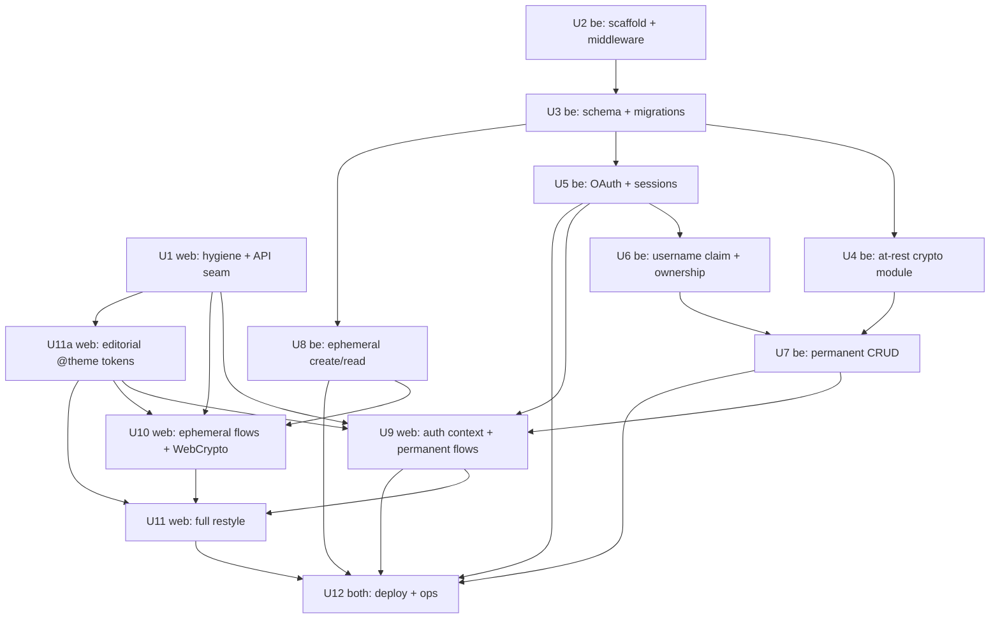

> **External prerequisite (do first):** Register a Google OAuth client in Google Cloud Console with redirect URIs for production (`https://api.tfke.id/auth/google/callback`) **and** local dev (`http://localhost:<port>/auth/google/callback`), request only `openid profile email` scopes. This has human/DNS lead time and **blocks end-to-end verification of Unit 5** — it is not solely a Unit 12 concern.

# feat: Split Tfke into tfke-web + tfke-be and harden for production

> **This plan spans two repos.** Each implementation unit names a **Target repo** (`tfke-web` or `tfke-be`). All file paths are repo-relative to that target repo. `tfke-web` is the existing repo (currently at the project root); `tfke-be` is a new repo.

## Overview

Tfke.id is a "linktree for payment info." It is currently a frontend-only React 19 + Vite SPA with **no backend** — data lives in an in-memory `src/data/mockUsers.js` plus `localStorage`, and auth is fake (hardcoded passwords). This plan splits it into two independently deployable repos and builds the backend that does not exist yet:

- **`tfke-web`** — the existing SPA, rewired to a real API, fully restyled, deployed static to Netlify/Vercel (`tfke.id`).
- **`tfke-be`** — a new Node + Hono + TypeScript + PostgreSQL API on the user's VPS (`api.tfke.id`).

It adds a **two-tier account model** (ephemeral zero-knowledge pages and permanent Google-authenticated pages), encryption so payment data is unreadable in a stolen DB dump, and a full visual restyle to a light, editorial aesthetic.

## Problem Frame

The product shares sensitive payment details (bank account numbers, e-wallet handles, phone numbers) via public links. "Production-ready" therefore means: real persistence, real auth, and a privacy model where a stolen database dump or backup reveals no readable payment data. See origin: `docs/brainstorms/2026-05-28-tfke-split-and-prod-hardening-requirements.md`.

**Guarantee boundary (decided in brainstorm):** the permanent tier's at-rest encryption protects a stolen DB dump/backup only; full-server compromise is explicitly out of scope. The ephemeral tier is zero-knowledge (the key never reaches the server).

## Requirements Trace

Carried from the origin document (R1–R29). Grouped; each maps to implementation units below.

**Repo & Deployment** — R1 two repos, R2 Netlify/Vercel + VPS, R3 env API base URL + CORS allowlist → Units 1, 2, 12
**Backend & Data** — R4 Hono+TS+Postgres, R5 remove mock/fake-auth, R6 API surface + repurpose `/u/:username` → Units 2, 3, 7, 8, 9
**Auth & Tiers** — R7 two tiers, R8 ephemeral (CSPRNG ≥128-bit token, read-time expiry, rate-limited reads), R9 permanent editable, R10 Google-only, R21 ownership/IDOR, R22 OAuth PKCE + CSRF + session cookie, R23 username claim → Units 5, 6, 7, 8, 9, 10
**Encryption & Privacy** — R11 never plaintext at rest, R12 ephemeral zero-knowledge (key in `#k=`), R13 permanent at-rest env key (guarantee boundary), R14 threat model, R15 HTTPS + secrets in env, R24 fragment-leak mitigations, R25 no plaintext in logs, R26 key-version + encrypted backups + escrow → Units 4, 8, 10, 12
**Frontend Restyle** — R16 full pivot, R17 tooling + fallback, R27 concrete tokens + anti-slop removal, R28 UX states & flows → Units 9, 10, 11
**Production Hardening** — R18 env config, R19 validation + rate limiting + secure headers, R20 cleanup job, R29 TLS termination + cert renewal + migration tooling → Units 2, 8, 12

**Success criteria** (origin): both repos deploy independently and the app works end-to-end against the real backend; a raw PostgreSQL dump reveals no readable payment data (ephemeral: no key on server; permanent: ciphertext without the env key — boundary: dump/backup only, not full-server compromise); ephemeral pages unreachable after 3 days; permanent page editable cross-device after Google login; every page in the makingsoftware.com visual family; backend hardening verified (PKCE+CSRF, ownership rejects non-owners, ephemeral reads rate-limited + expire at read time, no decrypted data in logs).

## Scope Boundaries

- No app-managed email/password accounts in v1 — Google OAuth only for permanent pages.
- No ephemeral→permanent claim/upgrade flow in v1.
- No payment processing or transactions — display/sharing only.
- No team/organization/multi-owner features.
- Ephemeral pages are not editable.
- No account recovery if a Google account is lost, and no merge across multiple Google accounts (v1) — the username-claim screen warns that the choice is permanent.

## Context & Research

### Relevant Code and Patterns

- `src/data/mockUsers.js` — the entire current "database" (in-memory CRUD). **Delete/replace** with API calls.
- `localStorage('tfke_user')` used as session+store in `src/components/Navbar.jsx`, `src/pages/Dashboard.jsx`, `src/pages/Login.jsx`, `src/pages/Register.jsx`. The `window.location.reload()`-after-navigate trick exists only so `Navbar` re-reads storage — **replace with a real auth context**.
- `src/pages/PublicProfile.jsx` — has the loading / not-found / empty-state triad to extend (expired ≠ not-found; decrypt-fail ≠ not-found). **Bug:** `require('../data/platforms')` at `src/pages/PublicProfile.jsx:47` in an ESM project — replace with a top-level import during the API rewire.
- `src/pages/Landing.jsx:36` — hardcoded `/u/askar` "See Example" link tied to the seed mock user; remove or repoint (R6).
- `src/index.css` — Tailwind v4 `@theme` block is the single source of design tokens (no `tailwind.config.js`, no PostCSS). The `.glass`, `.gradient-text`, glow-blob, and animation utilities here are the **restyle target** (R27 anti-slop list).
- `Dockerfile` + `nginx.conf` — current static-SPA serving (copies a prebuilt `dist/`). `tfke-web` moves to Netlify/Vercel, so these are dropped from `tfke-web`; the nginx pattern is repurposed on the VPS as the TLS-terminating reverse proxy in front of `tfke-be` (R29).
- `src/build-id.js` + `no-store` meta tags in `index.html` + "force rebuild" comment in `src/main.jsx` — manual cache-busting hacks for the nginx deploy; redundant under Netlify/Vercel atomic deploys — remove.
- **No TypeScript, ESLint, Prettier, tests, CI, `.gitignore`, or `AGENTS.md`** anywhere. `node_modules/` and `dist/` are committed (6073 tracked files). Repo hygiene is a prerequisite for a clean split.

### Institutional Learnings

- `docs/solutions/` does not exist — no prior learnings. Recommend seeding it after this work (the crypto, OAuth, and CORS/CSRF pieces are worth compounding via `/ce:compound`).

### External References

- **Hono v4** standalone Node server (`@hono/node-server`, Node 22, TS 5.4+); built-in `hono/cors`, `hono/secure-headers`, `hono/csrf`, `hono/cookie` (async signed cookies); `hono-rate-limiter` (community); `@hono/zod-validator` + Zod. CORS with credentials must use an explicit origin allowlist, never `*`.
- **Drizzle ORM + pg**, migrations via `drizzle-kit generate` → review SQL → `migrate` (avoid `push` in prod). Store crypto material as `bytea` (not base64 text); a packed blob `version(1)||iv(12)||tag(16)||ct` is cleanest for a small app.
- **Arctic v3** for Google OAuth — confidential client (secret stays server-side) combining client secret **and** PKCE; `state` for CSRF; server-side code exchange at the API callback.
- **WebCrypto AES-GCM** (browser, ephemeral): 12-byte random IV per encryption, 256-bit key exported as base64url for the `#k=` fragment, tag auto-appended; decrypt rejects with opaque `OperationError` on any failure (map to one "invalid/expired link" state).
- **node:crypto AES-256-GCM** (server, permanent): explicit `getAuthTag()`/`setAuthTag()`, 12-byte IV per record, env-held 32-byte key keyed by version, optional `setAAD(recordId)` to prevent ciphertext transplant.
- **Cross-origin session:** host API as same-registrable-domain subdomain (`api.tfke.id`) → `SameSite=Lax; Secure; HttpOnly` session cookie + CORS allowlist + `credentials:'include'`, sidestepping the 2026 cross-site (`SameSite=None` without `Partitioned`) cookie deprecation. CSRF via `hono/csrf` Origin/`Sec-Fetch-Site` check + custom header.
- **OWASP:** ≥128-bit CSPRNG tokens; enforce expiry at read time (cleanup is GC, not the control); return uniform 404 for unknown/expired/burned to prevent enumeration; IDOR — scope queries by `owner_id` from the session, prefer 404 over 403 for not-owned; never log decrypted payment data, keys, tokens, or full URLs/bodies.
- **Vite deploy:** Netlify `public/_redirects` (`/* /index.html 200`) or Vercel `vercel.json` rewrites for SPA deep links; only `VITE_`-prefixed env vars reach the client and are **public** (API origin only — never secrets); values are baked at build time.

## Key Technical Decisions

- **API on `api.tfke.id` (subdomain of the SPA apex), session via HttpOnly+Secure+SameSite=Lax cookie scoped `Domain=.tfke.id`.** Rationale: same registrable domain makes the session cookie same-site, dodging the cross-site cookie deprecation and most CSRF exposure. **Deploy caveat (must reconcile):** decide the canonical SPA origin — apex `tfke.id` vs `www.tfke.id` — since Netlify/Vercel often canonicalize to `www` and apex-CNAME has DNS constraints; the session cookie `Domain` must cover both the SPA origin and `api.tfke.id`. **Preview deploys (`*.netlify.app`/`*.vercel.app`) are cross-site — sign-in will not work there**, which is expected. **Fallback:** if the API must live on a fully separate registrable domain, switch to an in-memory bearer token (`Authorization` header) — documented, not the default.
- **Drizzle ORM + pg + drizzle-kit.** Rationale: one tool for typed schema + reviewable SQL migrations; smallest footprint for a small app; clean `bytea` modeling via `customType`.
- **Arctic v3 for OAuth** over `@hono/oauth-providers`. Rationale: explicit control of `state`/PKCE cookies and a custom session, which the BFF pattern needs.
- **Asymmetric encryption by tier.** Permanent: structured rows, per-field `node:crypto` AES-256-GCM with env key + `key_version` (server decrypts to render/edit). Ephemeral: the client encrypts the whole payload into **one opaque blob**; the server is a blind store and never sees the key. Rationale: matches the guarantee boundary and keeps the server genuinely zero-knowledge for ephemeral.
- **Packed crypto blob `version(1)||iv(12)||tag(16)||ct` as `bytea`.** Rationale: atomic, fewer columns, supports rotation by version byte.
- **Read-time expiry is the security control; cleanup job is defense-in-depth GC.** Rationale: a lagging/failed cron must never extend a secret's life (OWASP).
- **Ephemeral success screen is non-restorable and gated.** The key exists only in the rendered `#k=` link; require an explicit "I've saved my link" confirmation, copy the full `location.href` (including fragment), and never auto-redirect. `history.replaceState` fragment-stripping (R24) runs **only on the viewer after successful decrypt**, never on the creator's success screen.
- **Status-code contract for ephemeral reads:** `404` unknown token, `410` expired, `200` ciphertext; missing/malformed fragment → no API call (client broken-link state); decrypt failure → client GCM state. Uniform timing/response shape to avoid enumeration.
- **Generic server-rendered meta only.** Neither tier emits payment values in OG/meta tags; preview-bot prefetch must not consume a legitimate viewer's rate budget or confirm token existence.
- **Last-write-wins for permanent edits in v1**, with re-fetch-on-focus and an `updated_at` column (display/soft-signal only in v1). Rationale: single-owner tool; documented so implementers don't each invent concurrency control.
- **Wire format is `camelCase`; the API maps at the route boundary** (Drizzle rows are `snake_case` internally, serialized to `camelCase` out / parsed in). Rationale: preserves the existing web shape (`platformId`, `accountName`, `displayName`) so Unit 9 doesn't rewrite every consumer, and prevents silent casing drift across the JS↔TS gap. The canonical **payment-info shape** is `{ id (UUIDv7 string — was an integer; do not assume numeric/ascending; order by server `position`), platformId, value, label, accountName }` plus profile `{ displayName, bio, avatar }`. **Split ownership of platform data:** `tfke-be` owns only the `platformId` **allowlist** (a flat id list, the validation source of truth); `tfke-web/src/data/platforms.js` owns the **display registry** (`id → {name, color, category}`, pure presentation with no backend home). They can drift, so an unknown `platformId` from the API must render a **safe fallback** (default name/color), never crash.
- **Path namespace is intentionally mirrored across hosts:** `tfke.id/u/:username` is the rendered page, `api.tfke.id/u/:username` is its JSON; same for `/p/:token`. API routes are **not** prefixed with `/api`.
- **Ephemeral links are re-readable until expiry, not burn-after-read (v1).** Rationale: the product is "share a payment link," inherently re-viewable. Remove "burned" from the status contract; there is no read counter in v1.
- **Ephemeral read status contract refinement:** `404` (unknown) and `410` (expired) are intentionally **distinguishable** (an expired token is not a secret). Uniform timing/response shape applies only to the unknown-token vs malformed-fragment pair, not to 410.
- **`tfke-web` is a static SPA with no SSR:** "generic meta" means the single static `index.html` meta is identical for every `/u/...` and `/p/...` deep link — which inherently satisfies "no payment values in meta." Per-route meta only becomes a concern if a prerender/SSR step is added later.
- **Sessions are server-side (opaque random session ID in the cookie, backed by a `sessions` row), not stateless signed payloads.** Rationale: only a server-side record can be revoked on logout (R22), support idle/absolute timeouts, and be regenerated on the unauth→auth transition (fixation defense).

## Open Questions

### Resolved During Planning

- **Cross-origin session/CSRF mechanism** → `api.tfke.id` subdomain + SameSite=Lax Secure HttpOnly signed cookie + `hono/csrf` Origin check + custom header; bearer-token fallback documented for the separate-domain case.
- **Ephemeral read status contract** → 404 unknown / 410 expired / 200 valid; broken fragment = no API call; decrypt-fail = client-side.
- **Success-screen recoverability** → non-restorable by design; "I've saved my link" gate; copy full `location.href`; no auto-redirect.
- **Username-claim abandonment + availability race** → `username = null` is a first-class account state that always routes to the claim screen; the DB unique constraint is authoritative; the screen handles a post-submit `409` distinct from the inline availability check.
- **Preview-bot/meta policy** → generic meta only for both tiers; never payment values; bot prefetch must not burn rate budget or leak existence.
- **Concurrency** → last-write-wins v1, re-fetch on focus, `updated_at`.
- **Validation limits** → max payment-value length, max infos per page, server-side platform-id allowlist, per-IP ephemeral create cap, max ciphertext blob size; surface `Retry-After` on rate-limit, manual retry only, no auto-retry on create (avoids orphaned ephemeral rows).
- **DB tooling / OAuth lib / crypto primitives** → Drizzle+pg / Arctic v3 / AES-256-GCM (node:crypto server, WebCrypto client).
- **Wire-format casing** → `camelCase` at the API boundary; `tfke-be` owns the canonical info-shape + `platformId` allowlist; `src/lib/api.js` normalizes responses.
- **CSRF placement** → per-route-group, not global; OAuth callback uses the signed `state` cookie; anonymous ephemeral POST uses rate-limit + body-size.
- **Burn-after-read vs re-readable** → re-readable until expiry in v1 (no read counter); "burned" removed from the contract.
- **Username casing / format / reserved names** → `citext` for uniqueness, store-as-entered for display, reserved list against routes — resolves the brainstorm's deferred format-rules question.
- **Session model** → server-side `sessions` row (opaque ID), absolute+idle timeout, regenerate on login, revoke on logout.
- **Key rotation** → lazy re-encrypt-on-write in v1 (retired keys stay in the keyring until their rows are touched).

### Deferred to Implementation

- Exact token length (≥128-bit floor; likely 192–256-bit base64url) and final packed-blob byte layout once the schema is touched.
- Whether to back `hono-rate-limiter` with Redis (only if the VPS runs more than one Node process; in-memory is fine for a single process).
- Cleanup job mechanism (OS cron vs in-process interval vs pg-scheduled) — correctness does not depend on it (read-time expiry); pick at deploy time.
- Exact API↔web contract typing (web is JS, be is TS) — no shared package in v1; keep request/response shapes documented in `tfke-be` and mirrored in the `tfke-web` API client. Revisit OpenAPI generation later.
- Username format rules (length, allowed charset) — finalize the exact charset/length against the editorial design (reserved-name list resolved in Unit 6).
- Concrete rate-limit thresholds/windows for `GET /u/:username`, `GET /p/:token`, `/auth/google/start`, `POST /p` — committed as decisions; the actual numbers are tuned at implementation (a too-loose value undermines anti-enumeration/anti-harvest).
- **CGNAT consideration:** per-IP create caps may throttle many legitimate Indonesian users behind one carrier IP while an abuser rotates proxies. v1 keeps per-IP (tuned leniently) + the global ceiling; a soft signal / proof-of-work is a deferred enhancement if abuse appears.
- **Rich link unfurls:** the static-SPA "generic meta" satisfies the no-leak goal but means shared links never unfurl with a page-specific preview. Per-page unfurl would require a prerender/SSR step that must be carefully built to **never** include payment values — deferred enhancement, not v1.

## High-Level Technical Design

> *This illustrates the intended approach and is directional guidance for review, not implementation specification. The implementing agent should treat it as context, not code to reproduce.*

**System shape:**

```
  tfke.id (Netlify/Vercel)                       api.tfke.id (VPS)
  ┌───────────────────────┐   fetch(credentials  ┌──────────────────────────┐
  │  tfke-web  React 19    │   :'include')         │ nginx (TLS, cert renew)  │
  │  Vite static SPA       │ ───────────────────▶ │   └─▶ Hono (Node 22)      │
  │  WebCrypto (ephemeral) │ ◀─────────────────── │        Drizzle + pg       │
  │  src/lib/api.js        │  SameSite=Lax cookie  │        Arctic (OAuth)     │
  └───────────────────────┘                       │        node:crypto (perm) │
        key never sent (in #fragment)             └───────────┬──────────────┘
                                                              ▼
                                                    ┌────────────────────┐
                                                    │ PostgreSQL          │
                                                    │ users               │
                                                    │ payment_infos (enc) │
                                                    │ ephemeral_pages(blob)│
                                                    └────────────────────┘
```

**Two encryption flows (the core asymmetry):**

```
EPHEMERAL (zero-knowledge)                  PERMANENT (encrypted-at-rest)
browser: genKey → encrypt(payload)          browser: send plaintext field (HTTPS)
  → POST {blob} to api                        → api: encryptField(value, AAD=infoId)
  → api stores blob + token + expires_at        with env key[version], store bytea
  → link = /p/<token>#<keyB64url>             → render /u/:username: api decrypts
viewer: GET blob by token (404/410/200)        with env key, serves plaintext (HTTPS)
  → browser decrypts with key from #frag      guarantee: protects DB dump/backup only;
  → replaceState strips #frag post-decrypt    full-server compromise out of scope
server can read? NO                          server can read? YES (after auth / render)
```

**Unit dependency graph:** *(arrows point from prerequisite to dependent — `A --> B` means B depends on A)*



## Implementation Units

- [ ] **Unit 1: tfke-web repo hygiene + API client seam**

**Target repo:** tfke-web
**Goal:** Prepare the existing SPA repo for the split and introduce a single API access seam, without changing UI behavior yet.
**Requirements:** R1, R3, R18
**Dependencies:** None
**Files:**
- Create: `.gitignore`, `src/lib/api.js`, `public/_redirects`, `public/_headers`, `vercel.json`, `.env.example`
- Modify: `index.html` (drop `no-store` meta), `src/main.jsx` (drop `build-id` import + force-rebuild comment)
- Delete: `src/build-id.js`, `Dockerfile`, `nginx.conf`, committed `dist/`
- Test: `src/lib/api.test.js`
**Approach:**
- Add `.gitignore` (`node_modules/`, `dist/`, `.env*`) and untrack the committed `node_modules/` and `dist/`.
- `src/lib/api.js`: central fetch wrapper reading `import.meta.env.VITE_API_URL`, always `credentials: 'include'`, JSON helpers, and error normalization that maps HTTP status → typed errors (so callers distinguish 401/403/404/410/429). **It is also the single place response payloads are normalized into the documented camelCase info-shape** — so a backend field rename is caught/adapted in one file, not deep in components (the runtime guard for the no-shared-types decision). All future API calls go through this module.
- SPA fallback config for Netlify (`_redirects`) and Vercel (`vercel.json`).
- **Add the test runner** (neither repo has one today): Vitest + jsdom + `@testing-library/react` in `tfke-web` devDependencies with a `test` script and config — this makes every `*.test.jsx`/`*.test.js` file and the test-first execution notes actionable.
- **CSP + security headers have an implementation home here:** add `public/_headers` (Netlify) / `headers` in `vercel.json` (Vercel) with a concrete starting policy (`default-src 'self'`, no inline scripts, no third-party origins on viewer routes) plus `Referrer-Policy: no-referrer`. CSP is load-bearing for the zero-knowledge guarantee (XSS defeats it) and must not be left orphaned.
**Patterns to follow:** Existing ESM module style under `src/`.
**Test scenarios:**
- Happy path: `api.get('/x')` resolves JSON and includes credentials.
- Error path: 404/410/429 responses map to distinct typed errors; network failure surfaces a network error.
**Verification:** App still builds and runs against a stubbed `VITE_API_URL`; repo no longer tracks `node_modules/`/`dist/`.

- [ ] **Unit 2: tfke-be scaffold + global middleware**

**Target repo:** tfke-be
**Goal:** Stand up the Hono + TypeScript API skeleton with security middleware and validated env config.
**Requirements:** R3, R4, R15, R18, R19
**Dependencies:** None
**Files:**
- Create: `package.json`, `tsconfig.json`, `src/index.ts`, `src/app.ts`, `src/lib/env.ts`, `src/middleware/rateLimit.ts`, `src/routes/health.ts`, `.env.example`, `drizzle.config.ts`
- Test: `test/app.test.ts`
**Approach:**
- `@hono/node-server` entry in `src/index.ts`; root app + global middleware in `src/app.ts` (order: `cors` with explicit origin allowlist + `credentials:true` → `secureHeaders` → `bodyLimit` → rate limiter). **CSRF is applied per-route-group, NOT globally** — the OAuth callback (`GET /auth/google/callback`, Unit 5) is a cross-site top-level redirect from Google and would fail a global Origin check; it relies on the signed `state` cookie instead. The anonymous ephemeral `POST /p` (Unit 8) has no session to protect — guard it with rate-limit + body-size, not session-CSRF. Apply `hono/csrf` (Origin/`Sec-Fetch-Site`) only to cookie-session mutating routes.
- **Trusted-proxy client IP:** nginx (Unit 12) terminates TLS, so out of the box the rate limiter sees the loopback IP for every request. Configure the rate-limit `keyGenerator` to derive the real client IP from `X-Forwarded-For` with an explicit trusted-hop count (never blindly trust the header). Without this, every per-IP control collapses to one global bucket.
- `src/lib/env.ts`: zod-validated env (DATABASE_URL, GOOGLE_CLIENT_ID/SECRET, OAUTH_REDIRECT_URI, SESSION_SECRET, ENCRYPTION_KEYS, WEB_ORIGIN allowlist, TRUSTED_PROXY_HOPS) — fail fast on boot.
- **Repo bootstrap:** `git init` + initial `.gitignore`; pin `engines.node >=22`; choose the TS execution path (`tsx watch src/index.ts` for dev, `tsc` build + `node dist/index.js` for prod); add a test runner (Vitest or `node:test`) + `test` script. Runtime deps to install: `hono`, `@hono/node-server`, `drizzle-orm`, `pg`, `drizzle-kit`, `arctic`, `zod`, `@hono/zod-validator`, `hono-rate-limiter`, a UUIDv7 generator (e.g. `uuidv7`).
- `@hono/zod-validator` available for route input validation.
**Patterns to follow:** Hono "best practices" — inline handlers / factory, not extracted controllers (preserves typed params).
**Test scenarios:**
- Happy path: `GET /health` returns 200.
- Edge case: CORS preflight from an allowed origin succeeds; a disallowed origin is rejected.
- Edge case: two requests with different real client IPs (within the trusted-hop count) land in separate rate-limit buckets; a spoofed `X-Forwarded-For` beyond the trusted hops cannot set the key.
- Error path: missing required env var aborts startup with a clear error.
**Verification:** Server boots, health check passes, security headers present on responses.

- [ ] **Unit 3: Database schema + migrations**

**Target repo:** tfke-be
**Goal:** Define the persistent data model and reviewable migrations.
**Requirements:** R4, R5, R11, R26, R29
**Dependencies:** Unit 2
**Files:**
- Create: `src/db/schema.ts`, `src/db/client.ts`, `src/db/types.ts`, `migrations/0001_init.sql` (drizzle-kit generated)
- Test: `test/db/schema.test.ts`
**Approach:**
- `users`: `id` (**app-generated UUIDv7, not DB serial** — see Approach), `google_sub` (unique), `email`, `username` (citext unique, nullable until claimed), `display_name`, `bio`, `avatar` (derived initial, **not stored as image, not encrypted**; nullable), `created_at`, `updated_at`.
- `payment_infos` (permanent, owner-scoped): `id` (**app-generated UUIDv7**), `user_id` (FK, indexed), `platform_id`, `label`, `account_name_enc bytea`, `value_enc bytea` (each packed `version||iv||tag||ct`), `position`, `created_at`, `updated_at`. Encrypted set = `value` and `account_name`; `platform_id`, `label`, `position` are intentionally plaintext.
- `ephemeral_pages`: `id`, `token` (unique, indexed), `blob bytea` (opaque client-encrypted payload), `created_at`, `expires_at` (indexed for cleanup + read-time check).
- `sessions`: `id` (opaque random session ID, the cookie value), `user_id` (FK), `created_at`, `last_seen_at`, `expires_at` (absolute). Enables logout revocation + idle/absolute timeout (Unit 5).
- Enable `citext`; add `value` length/`infos`-per-page constraints where expressible. `bytea` via Drizzle `customType`.
**Technical design:** *(directional)* Use the packed-blob layout from Key Decisions so rotation works via the leading version byte. **IDs are app-generated (UUIDv7) before INSERT** so the primary key exists at encrypt time — it is used as the AES-GCM AAD (Unit 4), which a DB-generated serial could not provide without a two-phase insert.
**Patterns to follow:** Drizzle schema-as-source-of-truth; `drizzle-kit generate` then review SQL before `migrate`.
**Test scenarios:**
- Happy path: migrate up creates all tables/indexes; down reverts cleanly.
- Edge case: duplicate `username`/`google_sub`/`token` violate unique constraints; null `username` allowed.
- Integration: inserting a `payment_info` with a non-existent `user_id` fails the FK.
**Verification:** Migrations apply on a fresh Postgres; constraints enforced.

- [ ] **Unit 4: Server-side field encryption module (permanent at-rest)**

**Target repo:** tfke-be
**Goal:** Encrypt/decrypt permanent payment fields with an env key, supporting rotation, and prevent plaintext leakage.
**Requirements:** R11, R13, R25, R26
**Dependencies:** Unit 3
**Files:**
- Create: `src/lib/crypto.ts`, `src/lib/secret.ts` (non-loggable plaintext wrapper)
- Test: `test/lib/crypto.test.ts`
**Approach:**
- `node:crypto` AES-256-GCM; key map `version → 32-byte Buffer` from `ENCRYPTION_KEYS` env; `CURRENT_VERSION` = highest. `encryptField(plaintext, aad)` returns packed `bytea`; `decryptField(blob, aad)` selects key by version byte. Pass `setAAD(recordId)` — the AAD **is the row's UUIDv7 primary key** (Unit 3) — to bind ciphertext to its row and prevent transplant.
- **Rotation strategy is lazy (v1):** rows re-encrypt to `CURRENT_VERSION` on their next write; no bulk re-encrypt for routine rotation. Consequence: a retired key must stay in the keyring until all its rows have been touched. **Compromise escape hatch:** lazy rotation cannot force rows off a *leaked* key, so provide a **manual bulk re-encrypt routine** (idempotent, resumable: decrypt-with-old → encrypt-with-current for all rows) for the compromise case — even if run by hand. Without it, a leaked v1 key decrypts every untouched row forever.
- **AAD is the row's immutable id:** because the AAD must be byte-identical at decrypt time, a row's id can never change for the ciphertext's life — backup/restore must preserve ids, and there is no row relocation/duplication without re-encrypt. The AAD is not stored in the blob (it's the PK), so a lost/corrupted id makes the row undecryptable.
- `src/lib/secret.ts`: wrapper type whose `toString`/`inspect`/JSON serializer returns `[REDACTED]`, so accidental logging can't dump plaintext. Centralize all decryption through `crypto.ts`.
**Execution note:** Implement test-first — round-trip and tamper-rejection define correctness for this security-critical module.
**Patterns to follow:** Node GCM contract (`getAuthTag` after `final`; `setAuthTag` before `final` on decrypt).
**Test scenarios:**
- Happy path: encrypt→decrypt returns original; ciphertext differs across calls (fresh IV).
- Edge case: decrypt with the wrong key version → throws; rotating to v2 still decrypts v1 rows.
- Error path: tampered ciphertext/IV/tag → throws (no plaintext returned); AAD mismatch → throws.
- Edge case: a ciphertext encrypted under row A's id fails to decrypt under row B's id (transplant rejected by AAD).
- Integration: the secret wrapper renders `[REDACTED]` under `JSON.stringify`, `console.log`, and template interpolation.
**Verification:** All crypto tests pass; no path returns plaintext on auth failure.

- [ ] **Unit 5: Google OAuth + session management**

**Target repo:** tfke-be
**Goal:** Authenticate permanent users via Google (Authorization Code + PKCE, server-side exchange) and establish a session.
**Requirements:** R10, R22
**Dependencies:** Unit 3
**Files:**
- Create: `src/routes/auth.ts`, `src/lib/session.ts`, `src/middleware/requireAuth.ts`
- Test: `test/routes/auth.test.ts`
**Approach:**
- Arctic v3 Google provider; `GET /auth/google/start` generates `state` + PKCE verifier + OIDC `nonce`, stores all three in short-lived signed cookies (`HttpOnly; Secure; SameSite=Lax; Path=/auth; Max-Age≈600s` — `Lax` is required so the cookie survives Google's cross-site redirect back; `Strict` would break the callback), redirects to Google. **Note:** Arctic's `createAuthorizationURL(state, codeVerifier, scopes)` has no `nonce` param — set it manually via `url.searchParams.set('nonce', nonce)` before redirecting. **Rate-limit this endpoint per-IP** (same trusted-proxy keying as Unit 2) — it is anonymous and does CSPRNG/cookie work.
- `GET /auth/google/callback`: verify `state` matches the cookie, exchange code server-side, then **validate the ID token claims** (`iss=accounts.google.com`, `aud`=client ID, `exp`, `nonce` echo, `email_verified===true`) **before** trusting `google_sub`/`email`. RS256 **signature** verification is delegated to the TLS-protected direct server-side code exchange with Google's token endpoint (OIDC §3.1.3.7 permits skipping signature checks for tokens obtained directly from the token endpoint over TLS); if a JWKS-based signature check is wanted instead, add a `jose` dependency and verify against Google's JWKS. Then upsert `users` by `google_sub`.
- **Session:** create a `sessions` row (opaque random ID) and set it as the session cookie (`HttpOnly; Secure; SameSite=Lax`). Regenerate the session ID on login (fixation defense). Enforce absolute + idle timeouts on read. `POST /auth/logout` deletes the session row (replaying the old cookie → 401). `GET /auth/me` returns the current user or `{ user: null }`; `requireAuth` validates the session against the row.
- Any post-auth redirect target must be validated against the `WEB_ORIGIN` allowlist — never redirect to a user-supplied absolute URL (open-redirect/phishing).
- Generic, non-distinguishing errors on `state`/`nonce` mismatch / denied consent.
**Execution note:** Start with a failing integration test for the callback contract (state verification + user upsert + cookie set).
**Patterns to follow:** Arctic confidential-client flow; `hono/cookie` async signed cookies.
**Test scenarios:**
- Happy path: callback with valid `state`+code creates a new user and sets a session; a returning `google_sub` finds the existing user.
- Edge case: `/auth/me` returns `user:null` when unauthenticated.
- Error path (token validation, separate from CSRF/state): ID token with mismatched `aud`/`iss`, expired `exp`, or missing `nonce` echo → rejected before user upsert; `email_verified:false` → rejected; user-denied consent → graceful error redirect; a callback `return-to`/redirect param pointing off-origin does not redirect off-origin.
- Integration: replaying a pre-logout session cookie after logout → 401; a session past its absolute timeout → 401 even though the cookie is structurally valid; session cookie carries `HttpOnly`+`Secure`+`SameSite=Lax`.
**Verification:** Full login→me→logout cycle works against a mocked Google token endpoint.

- [ ] **Unit 6: Username claim + ownership enforcement**

**Target repo:** tfke-be
**Goal:** Require a unique username at first sign-in and enforce object-level authorization on all owner actions.
**Requirements:** R9, R21, R23
**Dependencies:** Unit 5
**Files:**
- Create: `src/routes/username.ts`, `src/middleware/requireUsername.ts`, `src/lib/ownership.ts`
- Test: `test/routes/username.test.ts`, `test/middleware/ownership.test.ts`
**Approach:**
- `GET /username/availability?u=` advisory check — **require an authenticated unclaimed session and rate-limit it** (it is otherwise a public username-enumeration oracle feeding mass-scrape of `/u/*`). `POST /username` claims atomically (DB unique constraint is authoritative). `username = null` is a first-class state: authed-but-unclaimed users are routed to claim; `requireUsername` blocks dashboard APIs until claimed.
- **Middleware composition:** dashboard routes run `requireAuth` (Unit 5) → `requireUsername` in that order.
- **Casing & reserved names:** store username as-entered for display but rely on `citext` for uniqueness/lookup (availability check and `/u/:username` are case-insensitive — the web client must stop assuming it can `.toLowerCase()` for lookup). Define a reserved-name list against real routes (`auth`, `me`, `p`, `u`, `dashboard`, `api`) plus future editorial pages; enforce format/length rules at claim. This resolves the brainstorm's deferred "username format rules."
- `ownership` helper scopes every owner query by `user_id` from the session (`WHERE id = :id AND user_id = :session_user`), returning 404 (not 403) when not owned — used by Unit 7.
**Patterns to follow:** OWASP IDOR — derive subject from session, scope the query, prefer 404.
**Test scenarios:**
- Happy path: claim an available username succeeds and unblocks dashboard APIs.
- Edge case: claiming a taken username → 409; invalid format or reserved name (`api`, `auth`, `me`, etc.) → 400; case-variant of a taken name (`Askar` vs `askar`) is rejected as taken (citext); abandoning claim leaves `username=null` and re-routes to claim on next request.
- Error path / integration: a concurrent double-claim — only one wins (unique constraint), the loser gets 409; the availability endpoint is rate-limited and rejects unauthenticated callers.
**Verification:** Dashboard APIs are unreachable until a valid unique username exists; ownership helper rejects cross-user access as 404.

- [ ] **Unit 7: Permanent page CRUD + public view**

**Target repo:** tfke-be
**Goal:** Owner CRUD for profile + payment infos (encrypted at rest) and the public `/u/:username` read.
**Requirements:** R6, R9, R11, R13, R14, R19, R21, R25
**Dependencies:** Units 4, 6
**Files:**
- Create: `src/routes/profile.ts`, `src/routes/publicProfile.ts`, `src/lib/validation.ts`
- Test: `test/routes/profile.test.ts`, `test/routes/publicProfile.test.ts`
**Approach:**
- Authed: `GET/PATCH /me/profile` (display name, bio), `GET/POST/PATCH/DELETE /me/infos` — encrypt `value` **and** `account_name` via Unit 4 on write, decrypt on read; ownership-scoped (Unit 6); last-write-wins with `updated_at`.
- Public: `GET /u/:username` decrypts and serves plaintext over HTTPS; 404 for unknown username; empty-state payload when no infos. **Rate-limit per-IP** (each client gets a separate quota so one attacker can't exhaust the global budget) — it is an unbounded per-hit AES-GCM decrypt and a mass-plaintext-egress path; username enumeration to harvest all plaintext is an in-scope abuse vector (state it in R14). No response cache (it would serve stale data against last-write-wins + re-fetch-on-focus; the rate limit alone covers the abuse vector). Generic meta only. **Canonicalize the URL:** `citext` makes `/u/Askar` and `/u/askar` resolve to the same row — redirect to the stored display casing so one canonical URL exists.
- Zod validation: payment-value max length, **`display_name` and `bio` max length** (both are served publicly), `username` length/charset (Unit 6), max infos per page, server-side `platform_id` allowlist.
- No decrypted values, keys, or full bodies in logs (use the secret wrapper + log scrubbing).
**Test scenarios:**
- Happy path: owner adds/edits/deletes infos; public read returns decrypted values + display info.
- Edge case: unknown username → 404; existing user with zero infos → empty state; value over max length / unknown platform_id → 400.
- Error path: non-owner edit/delete → 404 (ownership); public read is rate-limited per IP.
- Integration: a value written encrypted is unreadable as raw bytes in the DB but decrypts correctly on public read; logs contain no plaintext value.
- Integration (negative invariant): write a unique sentinel value through create/edit/render, then assert the sentinel appears **nowhere** in any table's raw bytes nor in captured logs — guards against a future column or log line silently breaking the no-plaintext guarantee.
**Verification:** Round-trip CRUD works; raw row inspection shows ciphertext; cross-user mutation blocked.

- [ ] **Unit 8: Ephemeral create + read (zero-knowledge store)**

**Target repo:** tfke-be
**Goal:** Anonymous create of an opaque encrypted blob with an unguessable token and 3-day read-time expiry; the server never sees the key.
**Requirements:** R8, R12, R14, R19, R20
**Dependencies:** Unit 3
**Files:**
- Create: `src/routes/ephemeral.ts`, `src/lib/token.ts`, `src/jobs/cleanup.ts`
- Test: `test/routes/ephemeral.test.ts`, `test/lib/token.test.ts`
**Approach:**
- `POST /p` (anonymous) stores the client-supplied opaque `blob` + a CSPRNG token (≥128-bit, base64url) + `expires_at = now + 3 days`. Per-IP create rate limit + max blob size. The server never receives or stores a key. **CSRF stance:** no session to protect → guarded by rate-limit + body-size, not session-CSRF (no global CSRF middleware, per Unit 2).
- Links are **re-readable until expiry** (not burn-after-read) — no read counter in v1.
- **Global storage ceiling:** per-IP caps can be bypassed by IP rotation (cheap behind CGNAT/proxies) to exhaust disk over the 3-day window. Add a global/aggregate create ceiling (max rows or total bytes → 429/503 when exceeded) plus disk-quota monitoring in the Unit 12 runbook. *(Note: for the Indonesian NATed user base, per-IP create caps also risk throttling many legit users behind one carrier IP — tune leniently and consider a soft signal/proof-of-work later; see Open Questions.)*
- `GET /p/:token` enforces expiry at read time: 410 if `expires_at` passed (even if not yet swept), 404 if unknown, 200 + blob otherwise. Rate-limited; `Cache-Control: no-store`; generic meta; bot prefetch must not consume the legitimate viewer's rate budget. 410-vs-404 is intentionally distinguishable; the unknown-token vs malformed-fragment pair should not be (malformed fragment makes no API call at all).
- `src/jobs/cleanup.ts` periodically hard-deletes expired rows (defense-in-depth; mechanism chosen at deploy).
**Patterns to follow:** OWASP token entropy + read-time expiry + uniform not-found.
**Test scenarios:**
- Happy path: create returns a token; read returns the exact stored blob (server never sees a key).
- Edge case: read an expired-but-unswept row → 410; unknown token → 404; oversize blob → 400.
- Error path: exceeding per-IP create limit → 429 with `Retry-After`.
- Integration: read-time expiry holds independently of the cleanup job (simulate clock past `expires_at` with the row still present).
**Verification:** Create→read works; expired tokens 410 without relying on cleanup; entropy ≥128 bits.

- [ ] **Unit 9: tfke-web auth context + permanent flows**

**Target repo:** tfke-web
**Goal:** Replace fake auth/mock data with a real auth context and wire the permanent (Google) flows to the API.
**Requirements:** R5, R6, R9, R22, R23, R28
**Dependencies:** Units 1, 5, 7, 11a (author against editorial tokens)
**Files:**
- Create: `src/context/AuthProvider.jsx`, `src/pages/ClaimUsername.jsx`, `src/components/GoogleSignIn.jsx`
- Modify: `src/App.jsx`, `src/components/Navbar.jsx`, `src/pages/Dashboard.jsx`, `src/pages/PublicProfile.jsx`, `src/pages/Landing.jsx`
- Delete: `src/data/mockUsers.js`, `src/pages/Login.jsx`, `src/pages/Register.jsx`
- Test: `src/context/AuthProvider.test.jsx`, `src/pages/ClaimUsername.test.jsx`, `src/pages/Dashboard.test.jsx`
**Approach:**
- `AuthProvider` calls `/auth/me` on mount and exposes `{ user, loading }`, removing the `localStorage` + `window.location.reload()` trick. `Navbar` reads context.
- Google sign-in entry replaces the deleted Login/Register pages; `ClaimUsername` screen with live availability + post-submit 409 handling; route guard sends `user && !username` to claim, unauthenticated dashboard access to sign-in.
- `Dashboard` CRUD via `src/lib/api.js`; `PublicProfile` fetches `/u/:username` (fix the `require()` bug → top-level import; replace `getUser`). Remove the `/u/askar` example link / repoint to a real demo.
- **Render every server-served field as inert text** with URL-scheme allowlisting (`https:` only; reject `javascript:`/`data:`) — even permanent payment values/display names are user-controlled and must never execute.
- **Dashboard IA + interaction states:** content hierarchy = profile header + share-link affordance first, then the ordered infos list, then add-info entry. Specify per-mutation states with copy — saving/in-flight, save-error + retry, delete confirmation, and a freshly-claimed **empty state** ("add your first payment method" onboarding, not a blank page). `position` ordering is **fixed insertion order in v1** (no drag UI). `updated_at` is a display/soft-conflict signal; re-fetch-on-focus shows the latest and the user re-applies if a stale edit was overwritten.
- **ClaimUsername states + copy:** idle, checking (debounced), available, taken (inline + post-submit 409), invalid-format (name the rule), reserved-name. A prominent **"this username is permanent — it can't be changed or recovered"** warning, with submission gated on acknowledging it (mirrors the ephemeral irreversibility warning; recovery/merge are out of scope).
- **OAuth loading UX:** an app-boot loading state while `/auth/me` resolves (no flash of signed-out UI), a "signing you in…" interstitial on return from the callback, and explicit landing destinations (new user → claim; returning claimed → dashboard; denied consent → sign-in with a friendly message).
**Patterns to follow:** Preserve the loading/empty/not-found triad from the current `PublicProfile`; existing copy-to-clipboard affordance.
**Test scenarios:**
- Happy path: authed user with username sees dashboard; edits persist via API; public profile renders fetched data.
- Edge case: authed user without username is routed to claim; claim shows taken/invalid states.
- Error path: unauthenticated dashboard access redirects to sign-in; unknown `/u/:username` shows not-found.
- Integration: auth state survives a reload via `/auth/me` (no page-reload hack).
**Verification:** No `localStorage`/mock/`reload()` remain; permanent flows work end-to-end against the API.

- [ ] **Unit 10: tfke-web ephemeral flows + WebCrypto**

**Target repo:** tfke-web
**Goal:** Client-side encrypted ephemeral create, the one-shot share screen, and the viewer with all failure states.
**Requirements:** R8, R12, R24, R28
**Dependencies:** Units 1, 8, 11a (author against editorial tokens)
**Files:**
- Create: `src/lib/webcrypto.js`, `src/pages/EphemeralCreate.jsx`, `src/pages/EphemeralSuccess.jsx`, `src/pages/EphemeralView.jsx`
- Modify: `src/App.jsx` (add `/p/:token` route), `src/pages/Landing.jsx` (primary "create now" path)
- Test: `src/lib/webcrypto.test.js`, `src/pages/EphemeralView.test.jsx`, `src/pages/EphemeralSuccess.test.jsx`
**Approach:**
- **Pin the ephemeral payload schema** (it is the encrypt↔decrypt contract): `{ displayName, infos: [{ platformId, value, label, accountName }] }` — explicitly **no** `username`/`bio`; `avatar` is derived client-side from `displayName`. `EphemeralView` is a **distinct renderer** from `PublicProfile` (the field sets differ — the ephemeral tier has no user row), though it may share presentational sub-components.
- `webcrypto.js`: generate AES-256-GCM key, encrypt that payload into one blob (`iv||ct+tag`), export key as base64url. **The key is generated and held in component state before the POST**; the success screen renders the link from that held key + the returned token. Create flow POSTs the blob to `/p`, receives a token, builds `/p/<token>#<keyB64url>`.
- **Accepted dead-token case:** if `POST /p` succeeds server-side but the response is lost (tab close / network blip), the row exists but the key is gone forever (it was never sent). This is an accepted dead token consistent with the no-auto-retry rule — document it so it isn't mistaken for a bug.
- **Render decrypted fields inert** with URL-scheme allowlisting (`https:` only; reject `javascript:`/`data:`) and schema-validate the payload client-side post-decrypt — the blob is fully attacker-controlled and the server cannot sanitize it (zero-knowledge), so the viewer must treat every field as hostile.
- `EphemeralSuccess`: shows the full link, copies `location.href` (entire URL incl. fragment), requires an "I've saved my link" confirmation before any navigation, never auto-redirects, warns the link is unrecoverable and expires in 3 days.
- `EphemeralView`: read fragment; if missing/malformed → broken-link state (no API call); else GET `/p/:token` (map 410→expired screen + "create your own" CTA, 404→broken-link); decrypt with the fragment key; on success render + `history.replaceState` to strip the fragment; on GCM failure → "can't open this link" state. A `<noscript>` **notice** (concrete copy) that the viewer requires JavaScript (it cannot render content — decryption is client-only by design; not a content fallback).
- **Accessibility of the safety-critical moments:** the copy action confirms via an `aria-live` polite announcement (not only the visual swap); the "I've saved my link" gate is a real disabled-until-checked control whose warning is read before the proceed button enables; on each viewer state transition (expired/broken/decrypt-fail/success) move focus to the new heading so it is announced. (A stripped-fragment reload yields a dead link — show a short "this link has already been opened on this device; reopen the original link" note rather than a bare failure.)
**Execution note:** Test the encrypt→upload→decrypt round trip first; it is the core correctness contract.
**Patterns to follow:** WebCrypto IV/tag behavior; map all decrypt failures to one state.
**Test scenarios:**
- Happy path: create→success→view decrypts and renders; copy yields a URL containing `#`.
- Edge case: view with missing/malformed fragment → broken-link, no API call; expired token → 410 screen; unknown → broken-link.
- Error path: wrong key / tampered blob → decrypt-fail state (no crash); leaving success screen requires confirmation.
- Edge case: a decrypted payload containing a `javascript:` value or HTML in the display name renders inert and never executes.
- Integration: `replaceState` strips the fragment only on the viewer after decrypt — never on the creator's success screen (copy still includes it).
**Verification:** Server never receives a key; all five viewer states render; success-screen copy includes the fragment.

- [ ] **Unit 11a: Editorial design tokens + base primitives**

**Target repo:** tfke-web
**Goal:** Establish the new light/editorial `@theme` token set and base primitives *before* the new screens are authored, so Units 9/10 don't build in the dark-glass theme and get re-styled.
**Requirements:** R16, R27
**Dependencies:** Unit 1
**Files:**
- Modify: `src/index.css` (`@theme` tokens), `index.html` (fonts)
- Create: `docs/design/tokens.md`
**Approach:** Capture the makingsoftware.com reference (agent/headless browser; fallback manual/token-spec) and define concrete tokens — named typeface(s) + type scale, light/neutral palette (hex), whitespace rhythm — plus base primitives (button, input, card, link). Remove the anti-slop token set (`.glass`, gradient utilities, glow blobs, `.gradient-text`). Legacy page restyling happens later in Unit 11.
**Test scenarios:** Test expectation: none — token/style scaffolding; downstream screens verify visually.
**Verification:** New screens in Units 9/10 can be authored entirely against the editorial tokens; no dark-glass tokens remain in `@theme`.

- [ ] **Unit 11: Full visual restyle (makingsoftware.com editorial)**

**Target repo:** tfke-web
**Goal:** Restyle the **legacy** pages (Landing, public profile, dashboard) to the editorial aesthetic established in Unit 11a, and verify whole-app fidelity.
**Requirements:** R16, R17, R27, R28
**Dependencies:** Units 9, 10, 11a
**Files:**
- Modify: `src/index.css` (`@theme` tokens), `index.html` (fonts), and every page/component under `src/pages/` and `src/components/`
- Create: `docs/design/tokens.md` (captured token spec + reference notes)
**Approach:**
- Tokens + base primitives come from Unit 11a. Here, restyle the **legacy** pages against them: Landing (two-creation-paths IA), public profile, dashboard. Remove the remaining anti-slop usage (the 3-up icon-in-circle grid in `Landing.jsx`, any leftover `.glass`/gradient classes). Iterate with the `frontend-design` skill + `design-iterator` agent.
- **Responsive + accessibility (cross-cutting):** define breakpoints and mobile-first reflow for every screen (payment links are opened mostly on phones); keyboard operability + visible focus rings on all interactive elements; ≥44×44px touch targets for copy/confirm/sign-in; `aria-live` announcements for dynamic state changes (decrypt result, copy confirmation, availability check).
- **Fidelity is checkable:** commit the captured reference (or reference screenshots) as a Unit 11a/11 artifact and define 3–5 concrete adherence checks against the token spec (typeface in use, type-scale steps, palette hex present, no gradient/blur tokens remaining, whitespace rhythm).
**Execution note:** Use the `frontend-design` skill; iterate via `design-iterator` with screenshot comparison. **Define the new `@theme` token set + base primitives FIRST** (a thin "Unit 11a" slice that precedes Units 9/10) so the new auth/ephemeral screens are authored against the editorial tokens from birth — otherwise Units 9/10 build screens in the dark-glass theme that this unit then rips out, doubling re-work. At minimum, Units 9/10 should use minimal/unstyled markup, not invest in glass-theme styling.
**Test scenarios:** Test expectation: none — visual change; verified by screenshot comparison, not unit tests.
**Verification:** Every page reads as the makingsoftware.com family and passes the adherence checks; no leftover dark-theme/glass/gradient screens; every screen passes keyboard-only navigation and renders correctly at 360px width.

- [ ] **Unit 12: Production deploy + operational hardening**

**Target repo:** both
**Goal:** Ship both apps with TLS, secrets, migrations, cleanup, and backups.
**Requirements:** R2, R3, R15, R18, R20, R26, R29
**Dependencies:** Units 5, 7, 8, 9, 11 (all prior units substantially complete)
**Files:**
- Create (tfke-be): `Dockerfile` or process-manager config, `deploy/nginx.conf` (reverse proxy + TLS), `README` deploy/runbook section
- Modify (tfke-web): host build-env config (Netlify/Vercel dashboard) — `VITE_API_URL=https://api.tfke.id`
**Approach:**
- `tfke-web` → Netlify/Vercel with custom domain `tfke.id`, SPA fallback (Unit 1), `VITE_API_URL` set in the host build env.
- `tfke-be` → VPS at `api.tfke.id`: nginx terminates TLS (auto-renew, e.g. Caddy/certbot), forwards `X-Forwarded-Proto` so `Secure`/SameSite cookies work; process manager runs the Node server; env holds `ENCRYPTION_KEYS`, OAuth creds, `SESSION_SECRET`, `DATABASE_URL`, `WEB_ORIGIN`. Run migrations on deploy; schedule the cleanup job.
- Confirm the **production** Google OAuth redirect URI (`https://api.tfke.id/auth/google/callback`) is registered (the client itself is an early external prerequisite — see top of plan). Configure encrypted DB backups with the encryption key escrowed **separately** from the backup (split custody).
- Verify the trusted-proxy IP config (Unit 2): two requests from different real client IPs land in different rate-limit buckets.
- If the VPS runs more than one Node process, the in-memory rate-limit store under-counts — back `hono-rate-limiter` with Redis (ties to Unit 8 correctness).
- **Secret provisioning & rotation:** provide all secrets (`SESSION_SECRET`, `GOOGLE_CLIENT_SECRET`, `DATABASE_URL`, `ENCRYPTION_KEYS`) via a `0600` systemd `EnvironmentFile` / process-manager secret store — never committed, never passed on the command line (shell history). Separate dev/prod values. Document rotation for each: rotating `SESSION_SECRET` invalidates all sessions (by design); `GOOGLE_CLIENT_SECRET` requires a Google Console update; `ENCRYPTION_KEYS` follows the lazy/compromise routine (Unit 4).
- **Smoke checks:** confirm CSP (`default-src 'self'`, no inline scripts) and `Referrer-Policy` headers actually arrive on production `/u/:username` and `/p/:token` responses (host config can silently drop them); confirm the session cookie is sent on a cross-subdomain fetch from the real deployed origin.
**Execution note:** Produce a Go/No-Go smoke checklist rather than scripted test commands.
**Test scenarios:** Test expectation: none — deployment/ops; verified by a smoke checklist (login works, public page loads, ephemeral create/view works, cookie attributes correct, cert valid, migrations applied, cleanup scheduled).
**Verification:** End-to-end works on the live domains; a raw DB dump shows no readable payment data; backups are encrypted with a separately-escrowed key.

## System-Wide Impact

- **Interaction graph:** the `AuthProvider` replaces the `localStorage`+`reload()` mechanism that `Navbar`, `Dashboard`, `Login`, `Register` all depended on — removing Login/Register and the reload hack must update every consumer. `src/lib/api.js` becomes the single client→server seam.
- **Error propagation:** API status codes carry meaning (401 unauth, 403/404 ownership, 404/410 ephemeral, 429 rate limit) — the web client must map each to a distinct UI state, not collapse them.
- **State lifecycle risks:** orphaned ephemeral rows (creator leaves before copying) occupy storage for 3 days; concurrent permanent edits are last-write-wins; cleanup lag must not extend secret lifetime (read-time expiry covers this).
- **API surface parity:** both tiers expose public read + the web viewer; meta-tag policy (generic only) must be applied to both server-rendered paths.
- **Integration coverage:** encrypt-at-rest round trip (write encrypted → read decrypted), zero-knowledge round trip (server never sees key), OAuth session across origins, ownership rejection — these need integration tests, not just unit mocks.
- **Path namespace mirrored across hosts:** `tfke.id/u/:username` (rendered page) and `api.tfke.id/u/:username` (JSON) are the same logical resource on different hosts; same for `/p/:token`. Do not "fix" this by prefixing API routes with `/api`.
- **PII exposure in a DB dump (conscious decision):** only payment `value` and `account_name` are encrypted. A dump still reveals tokens, usernames, emails, `google_sub`, display names, and bios in plaintext. The success criterion ("no readable payment data") holds, but reviewers must not assume whole-row protection. Optionally hash `google_sub` / encrypt `email` later.
- **Unchanged invariants:** the `platforms.js` reference data and the per-field copy-to-clipboard UX premise are preserved; the public-by-link sharing model is intentionally retained.

## Risks & Dependencies

| Risk | Likelihood | Impact | Mitigation |
|------|-----------|--------|------------|
| Cross-origin cookie/CSRF gets misconfigured | Med | High | Use `api.tfke.id` same-apex subdomain + SameSite=Lax; `hono/csrf` Origin check; document bearer fallback |
| Key in URL fragment leaks via clipboard/history/chat | Med | High | `Referrer-Policy`, strip fragment post-decrypt, strict CSP, warn link-is-secret, no recovery by design |
| XSS defeats zero-knowledge entirely | Low | High | Strict CSP, no third-party scripts on viewer pages, dependency pinning |
| At-rest guarantee overstated | — | High | Boundary explicitly scoped to DB-dump/backup; full-server compromise out of scope, stated in docs + UI |
| Lost env encryption key = permanent data loss | Low | High | Key versioning + separately-escrowed backup key (split custody) |
| Committed `node_modules`/`dist` pollute the new repos | High | Med | `.gitignore` + untrack in Unit 1 before splitting |
| `require()` bug in `PublicProfile` ships as-is | Med | Low | Fixed during the API rewire (Unit 9) |
| Per-IP rate limits collapse to one bucket behind nginx | High | High | Trusted-proxy `X-Forwarded-For` keying with explicit hop count (Unit 2/12) |
| Global CSRF middleware breaks the OAuth callback | Med | High | Per-route CSRF; callback relies on signed `state` cookie (Unit 2/5) |
| XSS via attacker-controlled decrypted/served fields | Med | High | Render inert + `https:`-only URL allowlist (Units 9/10); strict CSP (Unit 1) |
| Emails/`google_sub` exposed in a DB dump (PII, not payment data) | Med | Med | Conscious v1 acceptance; documented; hash/encrypt later if needed |

## Documentation / Operational Notes

- Add a `tfke-be` deploy runbook: DNS (`api.tfke.id` → VPS), TLS/cert renewal, env/secrets, migration command, cleanup-job setup, backup + key-escrow procedure, Google OAuth redirect-URI registration.
- After shipping, seed `docs/solutions/` with the crypto, OAuth/PKCE, and CORS/CSRF learnings (`/ce:compound`).

## Alternative Approaches Considered

- **Supabase / BaaS** — rejected in brainstorm; user has a VPS and wants control.
- **Monorepo with two deploy targets** — rejected; user chose two separate repos for clean independent deploys.
- **KMS-managed key for the permanent tier** — deferred; would close the full-server-compromise gap but adds ops the user declined for v1. Envelope encryption + `key_version` keeps it a drop-in upgrade later.
- **`SameSite=None` cross-site cookies** — rejected in favor of the same-apex subdomain, which dodges the 2026 partitioned-cookie deprecation.
- **Bearer token in memory** — kept as the documented fallback only if the API cannot share the SPA's parent domain.

## Phased Delivery

- **Phase 1 — Foundations:** Units 1, 2 (repo hygiene + API seam; backend scaffold).
- **Phase 2 — Data + crypto:** Units 3, 4 (schema/migrations; at-rest encryption).
- **Phase 3 — Auth:** Units 5, 6 (OAuth/sessions; username claim + ownership).
- **Phase 4 — API surface:** Units 7, 8 (permanent CRUD; ephemeral create/read).
- **Phase 5 — Web rewire:** Unit 11a (editorial `@theme` tokens — do this before 9/10 so new screens are authored against final tokens), then Units 9, 10 (auth context + permanent flows; ephemeral + WebCrypto).
- **Phase 6 — Ship:** Units 11 (restyle legacy pages against the established tokens), 12 (deploy + ops).
- **Prerequisite (before Phase 3):** register the Google OAuth client + redirect URIs (prod + local) — blocks Unit 5 end-to-end verification.

## Sources & References

- **Origin document:** `docs/brainstorms/2026-05-28-tfke-split-and-prod-hardening-requirements.md`
- Existing code: `src/data/mockUsers.js`, `src/pages/PublicProfile.jsx` (line 47 `require` bug), `src/index.css` (Tailwind v4 `@theme`), `src/pages/Landing.jsx:36`, `Dockerfile`, `nginx.conf`
- Hono v4 (cors/secure-headers/csrf/cookie/validation), `@hono/node-server`, `hono-rate-limiter`, `@hono/zod-validator`
- Drizzle ORM + drizzle-kit; PostgreSQL `bytea`/`citext`
- Arctic v3 Google OAuth (Authorization Code + PKCE)
- WebCrypto `SubtleCrypto` AES-GCM (MDN); `node:crypto` AES-256-GCM (Node docs)
- OWASP: IDOR Prevention, CSRF Prevention, Session Management, Logging cheat sheets; A01:2025 Broken Access Control
- Bitwarden Send / PrivateBin zero-knowledge fragment model; MDN Referer / Referrer-Policy
- Vite env & SPA deploy (Netlify `_redirects`, Vercel `vercel.json`)
